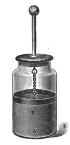

Project Leyden
==============

  

    
  

The primary goal of this Project is to improve the startup time,
time to peak performance, and footprint of Java programs.

 This Project is sponsored by the <a
href="/groups/hotspot/">HotSpot</a> and <a
href="/groups/core-libs/">Core Libraries</a> Groups. 

JEPs
----

  - [JEP 483: Ahead-of-Time Class Loading & Linking](https://openjdk.org/jeps/483)
  - [JEP draft: Ahead-of-Time Code Compilation](https://openjdk.org/jeps/8335368)
  - [JEP draft: Ahead-of-Time Method Profiling](https://openjdk.org/jeps/8325147)

Implementation
--------------

Development takes place in our OpenJDK GitHub repository,
[openjdk/leyden].  Most of our current work is in the [premain] branch.
From that branch we occasionally publish early-access builds at
[jdk.java.net/leyden], along with [release notes].  Please try out the
builds and let us know what you think!  You can send feedback to the
[leyden-dev] mailing list (subscribe to the list before posting).

[openjdk/leyden]: https://github.com/openjdk/leyden
[premain]: https://github.com/openjdk/leyden/tree/premain
[jdk.java.net/leyden]: https://jdk.java.net/leyden
[release notes]: https://github.com/openjdk/leyden/blob/leyden-ea1-release-notes/README.md
[leyden-dev]: https://mail.openjdk.org/mailman/listinfo/leyden-dev

Design notes
------------

  - [Thoughts on Training Runs](notes/05-training-runs) (2024/9)
  - [Condensing Indy Bootstraps](notes/04-condensing-bootstraps) (2023/8)
  - [Toward Condensers](notes/03-toward-condensers) (2023/7)
  - [Selectively Shifting and Constraining
    Computation](notes/02-shift-and-constrain) (2022/10)
  - [Project Leyden: Beginnings](notes/01-beginnings) (2022/5)

Presentations
-------------

  <!-- The   elements are intentional; please do not delete them. -->

  - _Project Leyden Update_ Ioi Lam, Dan Heidinga,
    [JVMLS&nbsp;2024](https://openjdk.org/projects/mlvm/jvmlangsummit/)
    ([video](https://youtu.be/OOPSU4LnKg0))

  - _Project Leyden: Capturing Lightning in a Bottle_ Per Minborg,
    Devoxx&nbsp;UK 2024 ([video](https://youtu.be/teXijm79vno))

  - _Choose Your Own Performance, a Project Leyden Update_ Dan
    Heidinga, DevNexus&nbsp;2024 ([video](https://youtu.be/NZSbZkKO90Y),
    [slides](slides/leyden-heidinga-devnexus-2024-03.pdf))

  - _Premain Case Study: Spring PetClinic_ Vladimir Ivanov, 2023/9
    ([slides](slides/leyden-premain-petclinic-2023-09-12.pdf))

  - _Project Leyden: Capturing Lightning in a Bottle_ Mark Reinhold,
    John Rose,
    [JVMLS&nbsp;2023](https://openjdk.org/projects/mlvm/summit2023/)
    ([video](https://youtu.be/lnth19Kf-x0),
     [slides](slides/leyden-jvmls-2023-08-08.pdf))

Resources
---------

  - Mailing list: [leyden-dev]
  - Repository: [openjdk/leyden]
  - Early access builds: [jdk.java.net/leyden] ([release notes])
